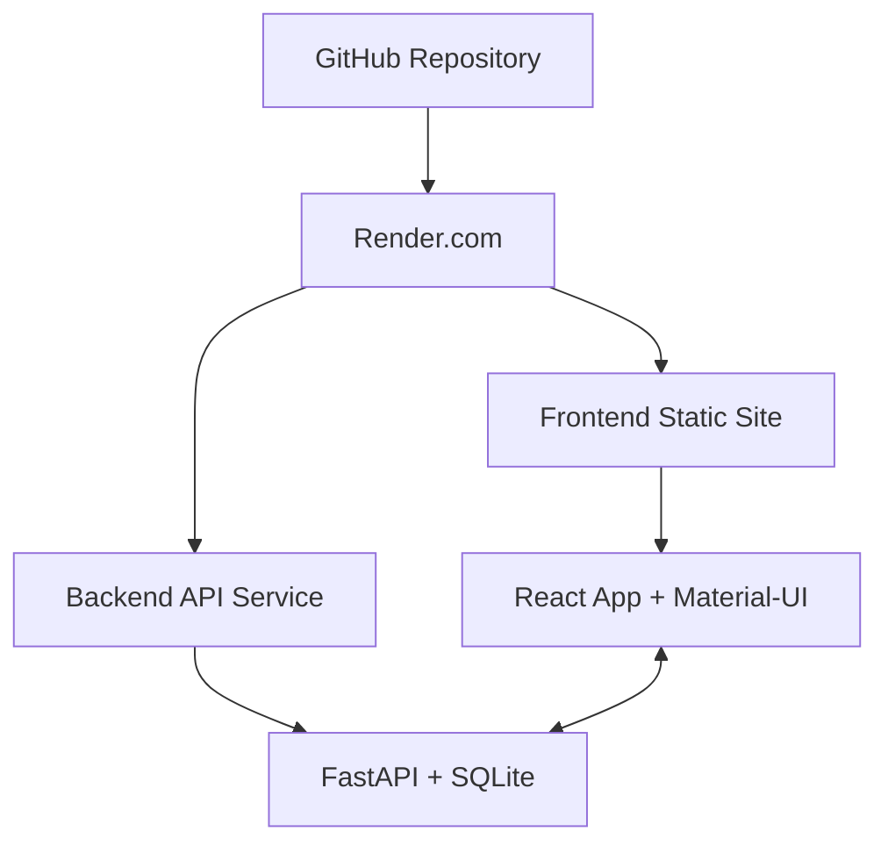

# 🚀 Deploy Frontend no Render.com - SEI-Com AI

## ✅ **VANTAGENS DO RENDER.COM PARA FRONTEND**

### 🎯 **Por que escolher Render.com?**
- ✅ **Backend e Frontend** no mesmo provedor
- ✅ **URLs próximas** (melhor latência)
- ✅ **Configuração unificada**
- ✅ **SSL automático**
- ✅ **CDN global**
- ✅ **Deploy contínuo** via GitHub

## 🛠️ **PASSO A PASSO COMPLETO**

### **1️⃣ Acessar Dashboard Render**
```bash
🌐 https://dashboard.render.com
```

### **2️⃣ Criar Static Site**
1. **Clique:** "New +" → "Static Site"
2. **Connect Repository:** Seu repositório GitHub
3. **Configure as opções:**

### **3️⃣ Configurações do Deploy**

#### **📂 Configurações Básicas:**
```yaml
Name: sei-com-ai-frontend
Branch: main
Root Directory: frontend
Build Command: npm run build:render
Publish Directory: dist
Auto-Deploy: Yes
```

#### **🔧 Configurações Avançadas:**
```yaml
# Adicionar estas variáveis de ambiente:
REACT_APP_API_URL=https://sei-jxdn.onrender.com/api/v1
REACT_APP_ENV=production
NODE_VERSION=18
```

#### **🌐 Configurações de Rotas (SPA):**
```yaml
# O Render detecta automaticamente SPAs
# Mas se necessário, adicionar:
Redirects and Rewrites:
Source: /*
Destination: /index.html
Action: Rewrite
```

### **4️⃣ Deploy Automático**
1. **Clique:** "Create Static Site"
2. **Aguardar build** (~3-5 minutos)
3. **✅ Deploy concluído!**

## 📋 **INSTRUÇÕES VISUAIS DETALHADAS**

### **Tela 1: New Static Site**
```
🖱️ Dashboard → New + → Static Site
```

### **Tela 2: Connect Repository**
```
📁 Connect GitHub
🔍 Procurar: SEI (seu repositório)
✅ Selecionar repositório
```

### **Tela 3: Configurar Deploy**
```
📝 Name: sei-com-ai-frontend
🌿 Branch: main
📂 Root Directory: frontend
🔨 Build Command: npm run build:render
📤 Publish Directory: dist
```

### **Tela 4: Environment Variables**
```
🔧 Add Environment Variable:

REACT_APP_API_URL
https://sei-jxdn.onrender.com/api/v1

REACT_APP_ENV
production

NODE_VERSION
18
```

### **Tela 5: Deploy**
```
🚀 Create Static Site
⏳ Aguardar build...
✅ Deploy successful!
```

## 🎯 **RESULTADO ESPERADO**

### **URLs do Sistema Completo:**
```
🖥️  Frontend: https://sei-com-ai-frontend.onrender.com
🔧  Backend:  https://sei-jxdn.onrender.com
📚  API Docs: https://sei-jxdn.onrender.com/docs
💓  Health:   https://sei-jxdn.onrender.com/health
```

### **Arquitetura Final:**


## 🔧 **CONFIGURAÇÃO AUTOMÁTICA**

### **Arquivo render.yaml (já incluído):**
```yaml
services:
  - type: static_site
    name: sei-com-ai-frontend
    staticPublishPath: ./dist
    buildCommand: npm run build:render
    envVars:
      - key: REACT_APP_API_URL
        value: https://sei-jxdn.onrender.com/api/v1
```

### **Build Script Otimizado:**
```json
{
  "scripts": {
    "build:render": "REACT_APP_API_URL=https://sei-jxdn.onrender.com/api/v1 webpack --mode production"
  }
}
```

## 🐛 **TROUBLESHOOTING**

### **✅ CORREÇÕES APLICADAS (27/06/2025)**
```bash
🛠️ Problemas resolvidos na configuração:

1. Webpack Mode: 
   - Antes: mode: 'development' (hardcoded)
   - Agora: mode dinâmico via argv.mode

2. Template Path:
   - Antes: path.resolve(__dirname, 'public', 'index.html')  
   - Agora: './public/index.html' (simplificado)

3. DefinePlugin:
   - Antes: 'process.env': { ... } (causava conflitos)
   - Agora: variáveis individuais sem conflitos

4. Cross-env:
   - Adicionado para compatibilidade Windows/Linux

5. Cache Busting:
   - Filename com hash em produção: bundle.[contenthash].js

✅ Build testado: 893KB bundle gerado com sucesso
```

### **Problema: Build Failed**
```bash
✅ Solução:
1. Verificar Node.js version (18+)
2. Confirmar dependências no package.json
3. Testar build local: npm run build
```

### **Problema: 404 nas rotas**
```bash
✅ Solução:
1. Adicionar redirect: /* → /index.html
2. Configurar SPA routing no Render
```

### **Problema: API não conecta**
```bash
✅ Solução:
1. Verificar REACT_APP_API_URL
2. Confirmar CORS no backend
3. Testar endpoint: /health
```

## 📊 **LOGS E MONITORAMENTO**

### **Acompanhar Deploy:**
```bash
🔍 Render Dashboard → seu-app → Logs
📊 Ver progress do build em tempo real
✅ Confirmar "Deploy successful"
```

### **Testar Aplicação:**
```bash
1. 🌐 Acessar URL do frontend
2. 🧪 Testar todas as páginas
3. 🔌 Verificar conexão com API
4. 📱 Testar responsividade
```

## 🎊 **VANTAGENS DO RENDER COMPLETO**

### **Backend + Frontend no Render:**
```
✅ Gestão unificada
✅ URLs no mesmo domínio (.onrender.com)
✅ Configuração centralizada
✅ SSL automático para ambos
✅ Deploy sincronizado
✅ Logs centralizados
✅ Monitoramento conjunto
```

### **Resultado Final:**
```
🎉 SISTEMA COMPLETO NO RENDER.COM:

Frontend React ↔️ Backend FastAPI
        ↓
    Render.com (tudo unificado)
        ↓
  URLs próximas + baixa latência
```

## 🚀 **PRÓXIMO PASSO**

**Execute agora:**
1. **Acesse:** https://dashboard.render.com
2. **New +** → **Static Site** 
3. **Conecte** seu repositório
4. **Configure** conforme o guia acima
5. **Deploy!** 🎉

**Em 5 minutos você terá o sistema completo funcionando no Render.com!** 