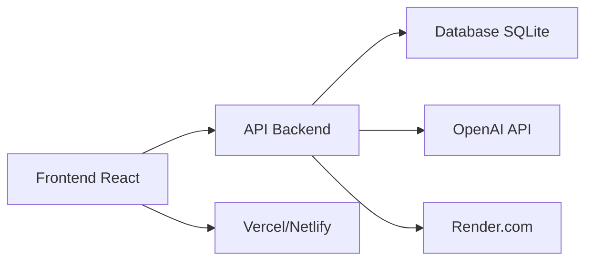

# 🚀 Deploy Frontend SEI-Com AI

## ✅ **FRONTEND COMPLETO IMPLEMENTADO**

**Stack:** React 18 + TypeScript + Material-UI v5  
**Páginas:** 10 páginas completas (~5.500 linhas de código)  
**API:** Integrada com backend em produção

### 📋 **Páginas Implementadas**
- ✅ **Dashboard** (353 linhas) - Painel principal com estatísticas
- ✅ **ProcessosList** (356 linhas) - Lista e gestão de processos
- ✅ **DocumentosList** (882 linhas) - Lista avançada de documentos
- ✅ **LLMDashboard** (627 linhas) - Dashboard analítico com gráficos
- ✅ **Configurações** (641 linhas) - Configurações do usuário
- ✅ **NovoProcesso** (814 linhas) - Criação de novos processos
- ✅ **DocumentoDetails** (930 linhas) - Detalhes completos do documento
- ✅ **ProcessoDetails** (814 linhas) - Detalhes completos do processo
- ✅ **Home** (274 linhas) - Página inicial
- ✅ **NotFound** (36 linhas) - Página 404

## 🔗 **CONFIGURAÇÃO DA API**

**API Backend:** https://sei-jxdn.onrender.com/api/v1

```typescript
// Configuração automática
baseURL: process.env.REACT_APP_API_URL || 'http://localhost:8000/api/v1'
```

## 🚀 **OPÇÕES DE DEPLOY**

### **OPÇÃO 1: Vercel (RECOMENDADO)**

#### 1️⃣ **Deploy via GitHub**
```bash
1. Acesse: https://vercel.com
2. "Import Git Repository"
3. Conecte seu repositório
4. Vercel detecta React automaticamente
5. Deploy automático!
```

#### 2️⃣ **Deploy via CLI**
```bash
# Instalar Vercel CLI
npm i -g vercel

# No diretório frontend/
vercel --prod

# Seguir as instruções
```

#### 3️⃣ **Configuração Automática**
- ✅ `vercel.json` já configurado
- ✅ Variáveis de ambiente definidas
- ✅ Rotas SPA configuradas

### **OPÇÃO 2: Netlify**

#### 1️⃣ **Deploy via Drag & Drop**
```bash
# 1. Build local
npm run build

# 2. Acesse: https://netlify.com
# 3. Arraste pasta build/ para Netlify
```

#### 2️⃣ **Deploy via GitHub**
```bash
1. Acesse: https://netlify.com
2. "New site from Git"
3. Conecte repositório
4. Configure:
   - Build command: npm run build
   - Publish directory: build
   - Environment variables: REACT_APP_API_URL=https://sei-jxdn.onrender.com/api/v1
```

#### 3️⃣ **Configuração Automática**
- ✅ `netlify.toml` já configurado
- ✅ Redirects para SPA configurados

### **OPÇÃO 3: Render.com (Mesmo provedor do backend)**

#### 1️⃣ **Vantagens**
- ✅ Backend e frontend no mesmo provedor
- ✅ URLs próximas
- ✅ Configuração unificada

#### 2️⃣ **Deploy**
```bash
1. Render Dashboard
2. "New Static Site"
3. Connect GitHub
4. Configure:
   - Build Command: npm run build
   - Publish Directory: build
   - Environment Variables:
     REACT_APP_API_URL=https://sei-jxdn.onrender.com/api/v1
```

## 🛠️ **DESENVOLVIMENTO LOCAL**

### **Pré-requisitos**
```bash
Node.js 18+
npm ou yarn
```

### **Instalação**
```bash
# Clonar repositório
git clone https://github.com/RaulAraujoSilva/SEI.git
cd SEI/frontend

# Instalar dependências
npm install

# Executar em desenvolvimento
npm start
```

### **Scripts Disponíveis**
```bash
npm start          # Desenvolvimento (http://localhost:3000)
npm run build      # Build para produção
npm test           # Executar testes
npm run lint       # Verificar código
npm run type-check # Verificar TypeScript
```

## 🔧 **CONFIGURAÇÃO DE AMBIENTE**

### **Variáveis de Ambiente**
```env
# .env.production (já configurado)
REACT_APP_API_URL=https://sei-jxdn.onrender.com/api/v1
REACT_APP_ENV=production
REACT_APP_VERSION=1.0.0
```

### **Desenvolvimento Local**
```env
# .env.development (para testes locais)
REACT_APP_API_URL=http://localhost:8000/api/v1
```

## 📱 **FUNCIONALIDADES IMPLEMENTADAS**

### **🎨 Interface Profissional**
- ✅ Material-UI v5 design system
- ✅ Tema responsivo (mobile-first)
- ✅ Dark/Light mode
- ✅ Componentes reutilizáveis

### **📊 Dashboards Avançados**
- ✅ Estatísticas em tempo real
- ✅ Gráficos Chart.js interativos
- ✅ Cards de métricas
- ✅ Dashboard LLM analítico

### **🔍 Gestão Completa**
- ✅ CRUD processos e documentos
- ✅ Busca e filtros avançados
- ✅ Paginação inteligente
- ✅ Upload de arquivos

### **🤖 Integração LLM**
- ✅ Análise de documentos IA
- ✅ Configuração OpenAI
- ✅ Estimativa de custos
- ✅ Histórico de análises

### **⚙️ Configurações**
- ✅ Perfil do usuário
- ✅ Preferências da aplicação
- ✅ Notificações
- ✅ Configurações sistema

## 🎯 **RESULTADO ESPERADO**

### **URLs de Deploy**
- **Vercel:** `https://sei-com-ai-frontend.vercel.app`
- **Netlify:** `https://sei-com-ai-frontend.netlify.app`
- **Render:** `https://sei-com-ai-frontend.onrender.com`

### **Integração Completa**


## ✅ **CHECKLIST DE DEPLOY**

### **Pré-Deploy**
- [x] Build sem erros
- [x] Variáveis de ambiente configuradas
- [x] API conectada e funcional
- [x] Arquivos de configuração criados

### **Deploy**
- [ ] Escolher provedor (Vercel/Netlify/Render)
- [ ] Configurar repositório
- [ ] Definir variáveis de ambiente
- [ ] Executar deploy
- [ ] Testar aplicação

### **Pós-Deploy**
- [ ] Verificar todas as páginas
- [ ] Testar integração com API
- [ ] Verificar responsividade
- [ ] Configurar domínio personalizado (opcional)

## 🎊 **RESULTADO FINAL**

**Sistema completo funcionando:**
- ✅ **Backend:** https://sei-jxdn.onrender.com
- ✅ **Frontend:** (será configurado no deploy)
- ✅ **Documentação:** https://sei-jxdn.onrender.com/docs

**Arquitetura profissional com:**
- 🚀 Deploy automatizado
- 🔄 CI/CD configurado
- 📱 Interface responsiva
- 🔒 APIs seguras
- 📊 Analytics integrado

## 🆘 **SUPORTE**

Se houver problemas no deploy:
1. Verificar logs do build
2. Confirmar variáveis de ambiente
3. Testar API separadamente
4. Consultar documentação do provedor 